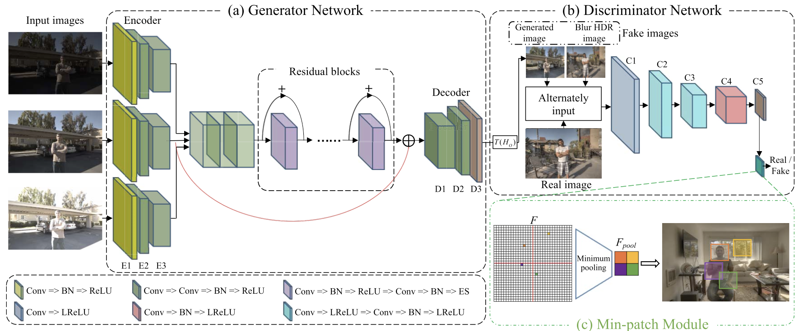
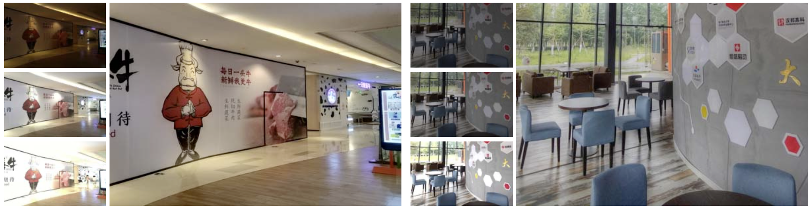

## UPHDR-GAN: Generative Adversarial Network for High Dynamic Range Imaging with Unpaired Data

This is the Pytorch implementation of our TCSVT 2022 paper [UPHDR-GAN](https://ieeexplore.ieee.org/abstract/document/9826814/).



## Dependencies

* Pytorch>=1.5.0
* Other requirements please refer to`requirements.txt`.

## Results



## Citation

```
@article{li2022uphdr,
  title={Uphdr-gan: Generative adversarial network for high dynamic range imaging with unpaired data},
  author={Li, Ru and Wang, Chuan and Wang, Jue and Liu, Guanghui and Zhang, Heng-Yu and Zeng, Bing and Liu, Shuaicheng},
  journal={IEEE Transactions on Circuits and Systems for Video Technology},
  volume={32},
  number={11},
  pages={7532--7546},
  year={2022},
  publisher={IEEE}
}
```

## Acknowledgments

In this project we use (parts of) the implementations of the following works:

* [NHDRRNet-pytorch](https://github.com/Galaxies99/NHDRRNet-pytorch) 
* [HDR-GAN](https://github.com/nonu116/HDR-GAN)

We thank the respective authors for open sourcing of their implementations.
